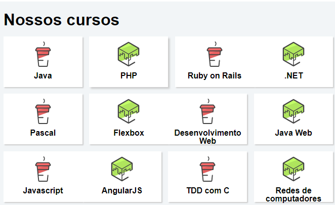

Flexbox site de cursos
=======
## 💻 Projeto

Aprenda Programação, Front-end, Data Science, UX, DevOps, Marketing,
 Inovação e Gestão plataforma de tecnologia, site feito usando  layout flexível permite que os 
elementos responsivos dentro de um contêiner sejam organizados automaticamente, dependendo do tamanho da tela. 

  

## :rocket: Tecnologias:

Esse projeto foi desenvolvido com as seguintes tecnologias:

- [HTML][html]
- [CSS][css]

Feito por Amadeu Filipe Lopes 👋🏽 [Entre em contato!](https://www.linkedin.com/in/amadeu-filipe-lopes12/)
⌨ 

[html]: https://developer.mozilla.org/pt-BR/docs/Web/HTML
[css]: https://developer.mozilla.org/pt-BR/docs/Web/CSS
